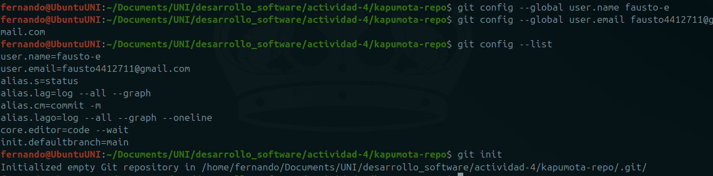
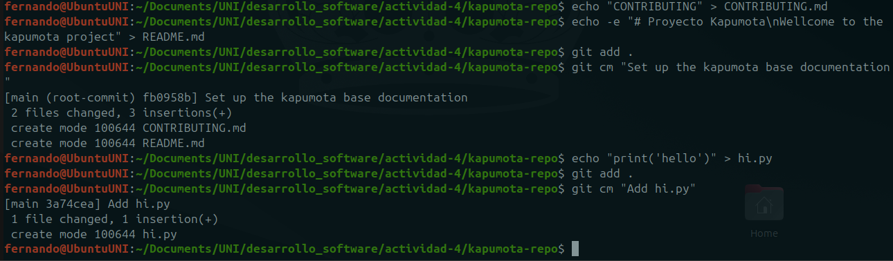

# Actividad 4
***
niveles de configuración
>System (todos los repositorios de todos los sistemas)
>	User (todos los repositorios de un usuario)
>		Local (repositorio local)

Configurar usuario y gmail
```shell
git config --global user.name
git config --global user.email
```

Listar las configuraciones
```shell
git config --list
```

Iniciar un repositorio git
```shell
git init 
```
o pasando un dir como argumento 
```shell
git init directory
```


``git add`` guarda los cambios mientras realizados y los prepara para almacenarlos permanentemente en el repositorio
``git commit`` los registra

``git status`` muestra el estado actual del repositorio.

Los archivos antes de ser preparados (*staged*) están en un espacio llamado area de trabajo(*workspace*). También se le refiere al *workspace* como *worktree*.

``git add file1.md file2.md file3.md`` añadir varios archivos
``git add *.md`` añadir todos los archivos .md

**Pregunta**: ¿Cuál es la salida de este comando?
```shell
$ git log --graph --pretty=format:'%x09 %h %ar ("%an") %s'
```
**Respuesta**:  ``%x09`` placeholder para un *tab* ``%h`` placeholder para el *hash* ``%ar`` placeholder para el *author date relative* ``%s`` placeholder para el mensaje al realizar el commit.


**Pregunta**: Intentemos el comando `git log` en este ejercicio (puedes realizar otra cosa como colocar las cosas en español). Primero, actualiza el archivo `README.md` y crea un nuevo archivo `CONTRIBUTING.md`:
```shell
$ echo "CONTRIBUTING" > CONTRIBUTING.md
$ echo -e "README\n\nWelcome to the kapumota project" > README.md
$ git add .
$ git commit -m "Set up the kapumota base documentation"
```
Añadimos el archivo ``hi.py`` .
```shell
$ echo "print('hello')" > hi.py
$ git add .
$ git commit -m "Add hi.py"
```

### Trabajando con ramas
***
``git branch`` muestra todas las *ramas* del repositorio
``git branch <branch name>`` crea una rama apartir de la rama actual
``git branch <new branch name> <branch name>|<commit hash>`` 
	crea una rama a partir de otra o partir de un commit
``git switch`` forma mas intuitiva de *cambiar* entre ramas
``git checkout -b <new-branch-name>`` crea y cambia de rama inmediatamente
``git switch -c <new-branch-name>`` equivalente al anterior
##### git merge: fusionando ramas

Para fusionar ramas primero debemos cambiar a la rama en la que queremos fusionar y luego realizar el merge con la rama deseada.
```shell
$ git checkout main
$ git merge feature/new-feature
```
##### git branch -d: eliminando una rama
Eliminamos ramas cuando ya no son necesarias para un merge.
```shell
$ git branch -d feature/new-featur
```
##### **Ejercicios**
***
###### **Ejercicio 1: Manejo avanzado de ramas y resolución de conflictos**
1. Crea una nueva rama llamada `feature/advanced-feature` desde la rama `main`:
```shell
$ git checkout -b feature/advanced-feature
```
2. Edita el archivo `hi.py` para incluir una función adicional para luego añadirlo y confirmarlo a los cambios:
```python
def greet():
	print('Hello from advanced new feature')
greet()
```

```shell
git add hi.py
git commit -m "Add greet in advanced new feature"
```


3. Simular un desarrollo paralelo en la rama main: Edita el archivo `hi.py` de forma diferente en la rama main y luego confirma los cambios:
```python
print('Hello World - updated in main')
```

```shell
git add hi.py
git commit -m "Update hi.py message on main branch"
```


4. Intentar fusionar la rama feature/advanced-feature en main:
```shell
git merge feature/advanced-feature
```

5. Resolver el conflicto de fusión: en mi caso mantendré el contenido de ambas ramas.
```shell
git add hi.py
git commit -m "Resolve merge conflict"
```

6. Elimina la rama fusionada
```shell
git branch -d feature/advanced-feature
```

###### **Ejercicio 2: Exploración y manipulación del historial de commits**
1. Ver el historial detallado de cada commit:
```shell
git log -p
```
	Este comando muestra todos los commit y sus diferencias.

2. filtrar commits por autor:
```shell
git log --author="fausto-e"
```

	
3. Revertir un commit:
	1. Primero añadí un cambio a ``hi.py``
	2. Luego realize un commit con los cambios
	3. finalmente revertí los cambios con ``git revert HEAD``
	
	4. Se puede verificar los cambios con ``git log -p``
	
4. Rebase interactivo:
	1. Añadí  los commits ``change 1``, ``change 2``, ``change 3`` al repositorio.
	2. Ejecuté git rebase -i HEAD~3.
	3. Cree un nuevo commit, combinación de los últimos 3, con el mensaje "Changes 1,2 and 3 on hi.py"
	
5. Visualización gráfica del historial:
	1. Ejecute ``git log --graph --oneline --all``
	2. ¿Qué información adicional puedes inferir?
		Con ``git log --oneline`` se ve el historial de commits de la rama actual, pero con ``git log --graph --oneline --all`` podemos ver todas las ramas y además en forma de grafo que nos ayuda a entender de manera visual el historial de commits.
		
###### **Ejercicio 3: Creación y gestión de ramas desde commits específicos
1. Crear una nueva rama desde un commit específico:
```shell
git branch bugfix/rollback-feature 6c48ae9
git checkout bugfix/rollback-feature
```
1. Modificar y confirmar cambios en la nueva rama y luego añade y confirma los cambios
```python
def greet():
	print('Fixed bug on bugfix')
```

```shell
git add bugfix.py
git commit -m "Fix bug in rollback feature"
```
3. Fusionar los cambios en la rama principal
```shell
git checkout main
git merge bugfix/rollback-feature
```
5. Eliminar la rama
```shell
git branch -d bugfix/rollback-feature
```

##### **Ejercicio 4: Manipulación y restauración de commits con git reset y git restore**
1. Hacer cambios en el archivo hi.py:
    - Edita el archivo `hi.py` para introducir un nuevo cambio:
        ```python
        print('This change will be reseted soon')
        ```
    - Añade y confirma los cambios:
        ```shell
        git add hi.py
        git commit -m "Introduce a change in hi.py"
        ```
2. Usar git reset para deshacer el commit:
    - Deshaz el commit utilizando `git reset` para volver al estado anterior:
        ```shell
        git reset --hard HEAD~1
        ```        
		
3. Usar git restore para deshacer cambios no confirmados:
    - Realiza un cambio en `README.md` y no lo confirmes:
        ```shell
        echo "Another line in README" >> README.md
        git status
        ```
    - Usa `git restore` para deshacer este cambio no confirmado:
        ```shell
        git restore README.md
        ```
		
##### **Ejercicio 5: Trabajo colaborativo y manejo de Pull Requests**
1. Crear un nuevo repositorio remoto:
    - Usa GitHub o GitLab para crear un nuevo repositorio remoto y clónalo localmente:
        ```shell
        git clone https://github.com/fausto-e/kapumota-repo remote-kapumota
        ```
2. Crear una nueva rama para desarrollo de una característica:
    - En tu repositorio local, crea una nueva rama `feature/team-feature`:
        ```shell
        git branch feature/team-feature
        git checkout feature/team-feature
        ```
3. Realizar cambios y enviar la rama al repositorio remoto:
    - Realiza cambios en los archivos del proyecto y confírmalos:
        ```shell
        echo "print('Collaboration is key')" > collaboration.py
	    git add .
        git commit -m "Add collaboration script"
        ```
																																- Envía la rama al repositorio remoto:
        ```shell
         git push origin feature/team-feature
        ```
		
		
		
4. Abrir un Pull Request:
    - Abre un Pull Request (PR) en la plataforma remota (GitHub/GitLab) para fusionar `feature/team-feature` con la rama `main`.
    - Añade una descripción detallada del PR, explicando los cambios realizados y su propósito.

5. Revisar y fusionar el Pull Request:
    - Simula la revisión de código, comenta en el PR y realiza cualquier cambio necesario basado en la retroalimentación.
    - Una vez aprobado, fusiona el PR en la rama `main`.
    
    
    
6. Eliminar la rama remota y local:
    - Después de la fusión, elimina la rama tanto local como remotamente:
        ```shell
        git branch -d feature/team-feature
        git push origin --delete feature/team-feature
        ```
		
		El error ocurre porque ya había eliminado la rama desde GitHub.
##### **Ejercicio 6: Cherry-Picking y Git Stash**
Instrucciones:
1. Hacer cambios en hi.py y confirmarlos:
    - Realiza y confirma varios cambios en `hi.py` en la rama `main`:
        ```shell
        $ echo "print('Cherry pick this!!')" >> hi.py
        $ git add hi.py
        $ git commit -m "Add cherry-pick example!"
        ```
        
2. Crear una nueva rama y aplicar el commit específico:
    - Crea una nueva rama `feature/cherry-pick` y aplícale el commit específico:
        ```shell
        git branch feature/cherry-pick
        git checkout feature/cherry-pick
        git cherry-pick <commit-hash>
        ```
    > En mi caso cree la rama feature/cherry-pick con un archivo cherry.py. Luego me moví a la rama main e hice un cherry pick a feature/cherry-pick con `git cherry-pick 25a654c`.

    
    
    

3. Guardar temporalmente cambios no confirmados:
    - Realiza algunos cambios en `hi.py` pero no los confirmes:
        ```shell
        echo "This change is stashed" >> hi.py
        git status
        ```
    - Guarda temporalmente estos cambios utilizando `git stash`:
    ```shell
    git stash
    ```
	
4. Aplicar los cambios guardados:
    - Realiza otros cambios y confírmalos si es necesario.
    - Luego, recupera los cambios guardados anteriormente:
    ```shell
    $ git stash pop
    ```
    
##### **Preguntas**
***
- ¿Cómo te ha ayudado Git a mantener un historial claro y organizado de tus cambios?
	>Los commits me ayudaron a mantener un historial de los cambios.
	>Las ramas hacen posible la colaboración en el proyecto junto a los `merge` , `cherry-pick` y `rebase`.
- ¿Qué beneficios ves en el uso de ramas para desarrollar nuevas características o corregir errores?
	>Podemos añadir funcionalidades o corregir errores sin modificar la rama principal y sin interferir en el trabajo de otros colaboradores.
- Realiza una revisión final del historial de commits para asegurarte de que todos los cambios se han registrado correctamente.
	>Revisaré todos los commits con `git log --all --graph`.
- Revisa el uso de ramas y merges para ver cómo Git maneja múltiples líneas de desarrollo.