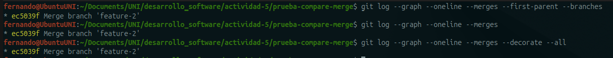
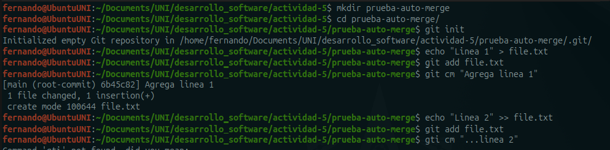
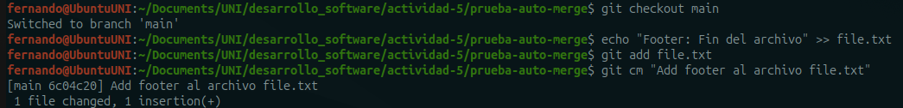
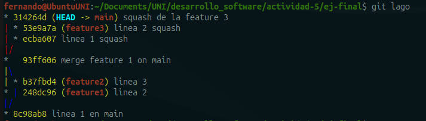

# Actividad 5

### Ejemplos
***
##### 1. Fusión fast forward
**Pregunta:** Muestra el historial de tu repositorio.


##### 2. Fusión no no-fast-forward
**Pregunta:** Muestra el log de commits resultante.


##### 3. Fusión squash

**Pregunta:** ¿Cuál es la estructura de los commit?


### Ejercicios 
***
##### Ejercicio 1

Cree un repositorio de prueba donde existe una rama que trata de añadir una feature. Sin embargo, esta feature tiene un bug y partir de esta rama, feature/add-feature, creo otra rama, bug/fix-bug-feature, para corregirlo. Como no se añadieron nuevos commits a la feature puedo hacer uso de `git merge --ff` para mantener una historia lineal en la feature.

- Imagen del repositorio inicial


- Hago uso del merge fast forward.


**Pregunta:** ¿En qué situaciones recomendarías evitar el uso de `git merge --ff`? Reflexiona sobre las desventajas de este método.
**Respuesta:** Evitaría usarlo cuando exista un nuevo commit en la rama objetivo o cuando se necesite mantener un historial claro de las razones del merge.

##### Ejercicio 2

- Simulare el flujo tomando de base las ramas *main* y *feature/add-feature* del repositorio de prueba del ejercicio 1. Después eliminaré las 2 ramas para prepararme para el ejercicio 3.

**Pregunta:** ¿Cuáles son las principales ventajas de utilizar `git merge --no-ff` en un proyecto en equipo? ¿Qué problemas podrían surgir al depender excesivamente de commits de fusión?
**Respuesta:** `git merge --no-ff` conserva el contexto del por qué se realizo la fusión y mantiene la trazabilidad de los cambios en el repositorio. Depender de los commits de fusión podría hacer que el historial se vea desordenado y difícil de seguir en proyectos con muchas ramas.

##### Ejercicio 3

- Creemos una rama *feature/new-feature* y añadiré dos commits a esta rama.

- Añado un nuevo commit a la rama main.

- Realizo el `git merge --squash`.

**Pregunta:** ¿Cuándo es recomendable utilizar una fusión squash? ¿Qué ventajas ofrece para proyectos grandes en comparación con fusiones estándar?
**Respuesta:** Es recomendable usarlo cuando quieres añadir los cambios de una rama sin añadir todos los commits que lo componen. Permite un historial limpio y fácil de seguir y sintetiza los cambios atómicos de una rama en un solo commit.

##### Ejercicio: Resolver conflictos en una fusión --no-ff
1. Inicializa un nuevo repositorio:
2. Crea un archivo index.html y realiza un commit en la rama main:
3. Crea y cambia a una nueva rama feature-update:
4. Edita el archivo y realiza un commit en la rama feature-update:
5. Regresa a la rama main y realiza una edición en el mismo archivo:
6. Fusiona la rama feature-update con --no-ff y observa el conflicto:

7. Git detectará un conflicto en index.html. Abre el archivo y resuelve el conflicto. Elimina las líneas de conflicto generadas por Git (`<<<<<<<`, `=======`, `>>>>>>>`) y crea la versión final del archivo con ambos cambios:

8. Agrega el archivo corregido y completa la fusión:
9. Verifica el historial para confirmar la fusión y el commit de resolución de conflicto:

**Preguntas:**
- ¿Qué pasos adicionales tuviste que tomar para resolver el conflicto?
	- Tuve que abrir `index.html` y modificarlo.
	- Cuando realize el merge --no-ff se abrió una un archivo de texto donde tenía que editar el mensaje del merge.
- ¿Qué estrategias podrías emplear para evitar conflictos en futuros desarrollos colaborativos?
	Trabajar en archivos diferentes o no modificar las líneas que sé que modificarán en otras ramas.

##### Ejercicio: Comparar los historiales con git log después de diferentes fusiones
Este ejercicio te permitirá observar las diferencias en el historial generado por fusiones fast-forward, non-fast-forward y squash.
##### Pasos
1. Crea un nuevo repositorio y realiza varios commits en dos ramas:
2. Fusiona feature-1 usando fast-forward:
```shell
git checkout main
git merge feature-1 --ff
```

3. Fusiona feature-2 usando non-fast-forward:
```shell
git merge feature-2 --no-ff
```
Resuelvo los conflictos


3. Realiza una nueva rama feature-3 con múltiples commits y fusiónala con squash:


4. Compara el historial de Git:
    - Historial Fast-forward:
	```shell
	git log --graph --oneline --merges --first-parent -–branches
	```
	- Historial Non-fast-forward:
	```shell
	git log --graph --oneline –-merges
	```
    - Historial con Squash:    
	```shell
	git log --graph --oneline --merges --decorate --all
	```
	
**Preguntas:**

- ¿Cómo se ve el historial en cada tipo de fusión?
	Todos parecen apuntar al commit del merge con la rama feature-2
- ¿Qué método prefieres en diferentes escenarios y por qué?
	El merge --ff es preferible para mantener un historial lineal y ordenado, el merge --no-ff se prefiere cuando se quiere registrar el contexto de una fusión y el merge squash ayuda a comprimir varios commits en uno solo (útil cuando hay varios commits en una rama).

##### Ejercicio: Usando fusiones automáticas y revertir fusiones
En este ejercicio, aprenderás cómo Git puede fusionar automáticamente cambios cuando no hay conflictos y cómo revertir una fusión si cometes un error.
##### Pasos
1. Inicializa un nuevo repositorio y realiza dos commits en main:
    
    
2. Crea una nueva rama auto-merge y realiza otro commit en file.txt:
    
3. Vuelve a main y realiza cambios no conflictivos en otra parte del archivo:
    
4. Fusiona la rama auto-merge con main:
5. Git debería fusionar los cambios automáticamente sin conflictos.
> Nota: tuve  conflicto en la última línea a pesar de seguir los comandos al pie de la letra.


    
6. Revertir la fusión: Si decides que la fusión fue un error, puedes revertirla:

7. Verifica el historial:

**Preguntas:**
- ¿Cuándo usarías un comando como git revert para deshacer una fusión?
	Cuando quiera mantener el historial del repositorio y el por qué del revert.
- ¿Qué tan útil es la función de fusión automática en Git?
	Te ayuda a realizar commits sin problemas y sin intervención manual lo que permite la colaboración sin revisar línea por línea.

##### Ejercicio: Fusión remota en un repositorio colaborativo
Este ejercicio te permitirá practicar la fusión de ramas en un entorno remoto colaborativo, simulando un flujo de trabajo de equipo.
##### Pasos:
1. Clona un repositorio remoto desde GitHub o crea uno nuevo:
> Haré uso de un repositorio de una actividad anterior.
2. Crea una nueva rama colaboracion y haz algunos cambios:
3. Empuja los cambios a la rama remota:
4. Simula una fusión desde la rama colaboracion en la rama main de otro colaborador. (Puedes usar la interfaz de GitHub para crear un Pull Request y realizar la fusión).


**Preguntas:**
- ¿Cómo cambia la estrategia de fusión cuando colaboras con otras personas en un repositorio remoto?
	Se añade el pedido para fusionar una rama y la comunicación se vuelve fundamental.
- ¿Qué problemas comunes pueden surgir al integrar ramas remotas?
	Pueden aparecer conflictos de fusión o se desordena el historial debido a fusiones innecesarias o no usar estrategias como rebase o squash. También se corre el riesgo de fusionar código que no ha sido probado correctamente.

##### Ejercicio final: flujo de trabajo completo
Configura un proyecto simulado:
- Crea un proyecto con tres ramas: main, feature1, y feature2.
- Realiza varios cambios en feature1 y feature2 y simula colaboraciones paralelas.
- Realiza fusiones utilizando diferentes métodos:
    - Fusiona feature1 con main utilizando `git merge --ff`.
    - Fusiona feature2 con main utilizando `git merge --no-ff`.
    - Haz una rama adicional llamada feature3 y aplasta sus commits utilizando `git merge --squash`.


Analiza el historial de commits:
- Revisa el historial para entender cómo los diferentes métodos de fusión afectan el árbol de commits.

`merge --ff` y `merge squash` ayudan a mantener un historial limpio y `merge --no-ff` deja un registro de la fusión.
- Compara los resultados y discute con tus compañeros de equipo cuál sería la mejor estrategia de fusión para proyectos más grandes.
Cada estrategia de fusión tiene sus pro y contras, y situaciones en las que se pueden realizar, pero yo pienso que se debe tratar de mantener un historial limpio y ordenado. Por ello los merge --ff y squash son los más deseables.